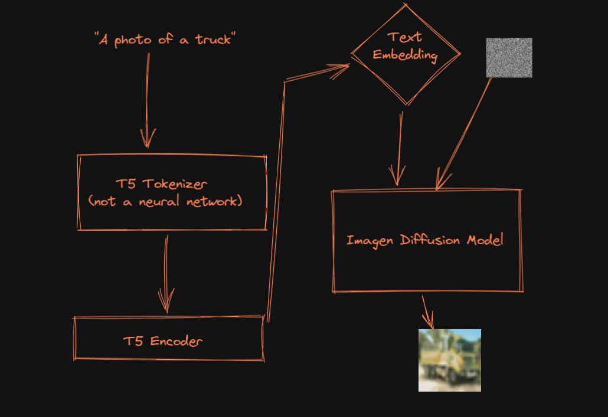

# Browser Based Imagen


This projects contains the scripts required for running imagen in the browser (i.e. using the actual chrome runtime). The GIF is sped up around 1000x, so in reality it  isn't practical in any way, but hopefully this repo will be useful to someone else trying to put text2img models in the browser. 

## How it Works

Imagen works by taking a text prompt, running it through a t5 tokenizer, and then a t5 encoder (a.k.a "transformer"), before passing the encoded text plus some random noise to a unet, and performing a long sampling loop.



This is the process I followed:

1. Trained a very small imagen model on cifar-10 classes using google colab (see links)
2. Converted the unet portion into onnx format using [torch.onnx](https://pytorch.org/docs/stable/onnx.html) (see `export_unet.ipynb`)
3. Downloaded an existing t5 transformer/tokenizer combo and exported these to ONNX/json (see `export_t5.ipynb`) respectively
4. Loaded all 3 (tokenizer, transformer, unet) into a chrome extension and used them to create a 250-step javascript inference loop where the output at each step is projected onto a html canvas

## Links
The actual extension (as well as the pretrained pytorch Imagen model) can be found on [huggingface](https://huggingface.co/lewington/browser-based-imagen/tree/main). Simply download, unzip locally, and then load the `build` directory into chrome using "load unpacked". You can also find a pretrained imagen model here (pretrained for the cifar-10 classes).

The script for training a tiny imagen model can be found in [this colab](https://colab.research.google.com/drive/1QZ6Gys5dYnojn4_fnn3aPkNRZaifHODt?usp=sharing). 

The wanb report from some successful training runs can be found [here](https://wandb.ai/lewington/cifar10-imagen/reports/Cifar-10-Imagen-Training--VmlldzozMDU5MzEw?accessToken=hs40l4pznlt11xxlj58ch6xms40jcp1zckg4n5cyv0zs2q35vkf3p2qm1sq0kvzg).

## Replication

There is very little actual code in this repo. It's mostly just piping together different existing APIs built by the smarty pants people.

1. Train the model, just run all cells of `imagen_koiboi.ipynb`, if you run outside of colab you will need to remove references to `google.colab`
    - In this case I am training using the cifar-10 training dataset, which consists of 50,000 images
    - Because the images are only 32x32 we only use a single Unet, and we reduce its parameters significantly and only perform 250 steps (rather than the usual 1000) per sample. We rely heavily on lucidrains excellent [imagen-pytorch](https://github.com/lucidrains/imagen-pytorch).
    - It took 67,000 steps at a batch size of 64 to get pretty average results (see the wanb report above)
    - We use a t5-base embedding of the sentence `"a photo of a class-name"` as the conditioning embedding for each class  
2. Convert the model to ONNX
    - Using `export_unet.ipynb` import the best model you trained and overwrite some of the internal functions so that all instances of the `expm1` function are removed from the model's internal graph (and replaced with an equivalent `faux_expm1` function). This is important since ONNX has no equivalent operation for `exmp1`. My math knowledge is very weak, so I used ChatGPT to write `faux_expm1`.
    - ONNX can only convert models which have a `forward` method, so we create a new `torch.nn.Module` class `ImagenOnnx` which wraps the `Imagen` instance and performs a single simplified `Imagen` sampling step using its `forward` method. 
    - We then convert an `ImagenOnnx` instance to ONNX using the standard `torch.onnx.export`.
3. Download the t5 tokenizer and transformer
    - The Tokenizer can be loaded from a json file, so all we need to do is download [that file](https://huggingface.co/google/t5-v1_1-base/blob/main/tokenizer_config.json)
    - The transformer we download and then convert into ONNX format using `export_t5.ipynb`
4. Load the tokenizer, transformer and imagen unet into the chrome extension (`toymodel/public/model.js`)
    - I used [chrome-extension-cli](https://github.com/dutiyesh/chrome-extension-cli) to generate the boilerplate for the extension and `npm run watch` to keep the `toymodel/build` directory (which is the actual extension you load into chrome) in sync with my changes.
    - We import `toymodel/public/tokenizers.js` from the excellent [transformers-js](https://github.com/praeclarum/transformers-js) repo into `toymodel/public/model.html` above `model.js`, which allows us to load the t5 tokenizer from json.
    - The transformer and unet are sitting in ONNX files which we import using [onnxruntime-web](https://cdn.jsdelivr.net/npm/onnxruntime-web/dist/ort.js), which in this case is sitting in `toymodel/public/ort.js` and imported into `model.html`. We end up with two ONNX sessions.*
5. Perform inference
    - Once the models are loaded we convert the prompt into an embedding using the tokenizer and the transformer session and then perform 250 sampling steps on this embedding with the unet session. Results are drawn onto a 32x32 canvas on the popup each step. On my computer it takes around 7 minutes for 250 steps to complete, and if you un-focus the popup you need to start again.


### *importing ONNX models into chrome extensions.

1. I found that the only reliable method was to use `https://cdn.jsdelivr.net/npm/onnxruntime-web/dist/ort.js`. Since this script relies on several generic javascript built-in constructs like `URL`, and `Worker` which are missing in both "content scripts" and "service workers", the only way I was able to get the import working was through an "extension page", in this case the popup itself. I also got hit with `CORS` errors if I tried to request this file from the web so I had to download it and include it in `toymodel/public`.
2. onnxruntime-web compiles the model into web-assembly, so I found it necessary to add the `toymodel/public/ort-wasm-simd.wasm` to `toymodel/public` to prevent errors complaining about there being no "wasm" backend. I found this file in `node_modules\onnxruntime-web\dist\ort-wasm-simd.wasm` after `npm install onnxruntime-web` and simply copied it over.
3. Executing web assembly code counts as "unsafe-eval" under the standard Content Security Policy and chrome's new Manifest v3 prevents most extensions from even loading if they have a CSP which permits "unsafe-eval". To get around this you need to set chrome extension sandbox permissions so that unsafe-eval is allowed inside sandboxes, and then specify that the page you are using to run any web assembly code is a sandbox. See `toymodel/public/manifest.json` for more details. If you don't do this you will get hit with CSP violations. 


## Citations

```bibtex
@inproceedings{Saharia2022PhotorealisticTD,
    title   = {Photorealistic Text-to-Image Diffusion Models with Deep Language Understanding},
    author  = {Chitwan Saharia and William Chan and Saurabh Saxena and Lala Li and Jay Whang and Emily L. Denton and Seyed Kamyar Seyed Ghasemipour and Burcu Karagol Ayan and Seyedeh Sara Mahdavi and Raphael Gontijo Lopes and Tim Salimans and Jonathan Ho and David Fleet and Mohammad Norouzi},
    year    = {2022}
}
```

```bibtex
@TECHREPORT{Krizhevsky09learningmultiple,
    author = {Alex Krizhevsky},
    title = {Learning multiple layers of features from tiny images},
    institution = {},
    year = {2009}
}
```


